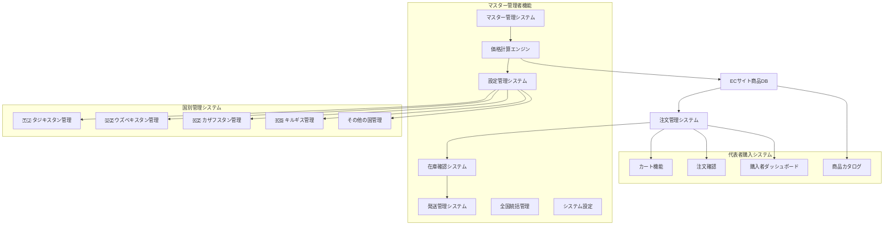

# TJ-Cosmetics 統合ECシステム 要件定義書 v5.0

## 1. システム全体構成

### システム名
TJ-Cosmetics Integrated E-commerce System (TJ-IES)

### アーキテクチャ概要


### 権限・アクセス制御設計
```typescript
interface SystemAccessLevels {
  // マスター管理者（全システム・全国データアクセス）
  masterAdmin: {
    access: 'all_systems' | 'all_countries';
    permissions: ['create', 'read', 'update', 'delete'];
    dashboard: '/admin/dashboard';
  };
  
  // 国別管理者（特定国のデータのみアクセス）
  countryAdmin: {
    access: 'country_specific';
    countryCode: 'TJ' | 'UZ' | 'KZ' | 'KG';
    permissions: ['read', 'update', 'create'];
    dashboard: '/country/{countryCode}/dashboard';
    dataScope: 'country_restricted';
  };
  
  // 代表購入者（自分の購入データのみアクセス）
  representative: {
    access: 'personal_orders_only';
    permissions: ['read', 'create'];
    dashboard: '/representative/dashboard';
    dataScope: 'personal_only';
  };
}
```

## 2. 国別管理システム設計

### 2.1 国別アカウント管理

#### アカウント構造
```typescript
interface CountryAccount {
  id: string
  countryCode: string              // 'TJ', 'UZ', 'KZ', 'KG'
  countryName: string              // 'タジキスタン', 'ウズベキスタン'等
  email: string
  hashedPassword: string
  displayName: string
  role: 'country_admin' | 'country_manager' | 'country_viewer'
  permissions: CountryPermission[]
  isActive: boolean
  lastLogin?: Date
  timezone: string                 // 'Asia/Dushanbe', 'Asia/Tashkent'等
  language: 'ja' | 'ru' | 'tg' | 'uz' | 'kk' | 'ky'
  currency: string                 // 'TJS', 'UZS', 'KZT', 'KGS'
  profile: {
    firstName: string
    lastName: string
    phone?: string
    address?: string
    notes?: string
  }
  createdAt: Date
  updatedAt: Date
  createdBy: string
}

interface CountryPermission {
  id: string
  name: string
  resource: 'dashboard' | 'products' | 'orders' | 'customers' | 'settings' | 'reports'
  actions: ('read' | 'create' | 'update' | 'delete')[]
  countryCode: string
  isActive: boolean
}
```

#### デフォルト国別アカウント
```typescript
const DEFAULT_COUNTRY_ACCOUNTS = {
  'TJ': { // タジキスタン
    email: 'admin@tajikistan.tj-cosmetics.com',
    password: 'tajikistan2024',
    displayName: 'タジキスタン管理者',
    timezone: 'Asia/Dushanbe',
    language: 'ja',
    currency: 'TJS'
  },
  'UZ': { // ウズベキスタン  
    email: 'admin@uzbekistan.tj-cosmetics.com',
    password: 'uzbekistan2024',
    displayName: 'ウズベキスタン管理者',
    timezone: 'Asia/Tashkent',
    language: 'uz',
    currency: 'UZS'
  },
  'KZ': { // カザフスタン
    email: 'admin@kazakhstan.tj-cosmetics.com', 
    password: 'kazakhstan2024',
    displayName: 'カザフスタン管理者',
    timezone: 'Asia/Almaty',
    language: 'kk',
    currency: 'KZT'
  },
  'KG': { // キルギス
    email: 'admin@kyrgyzstan.tj-cosmetics.com',
    password: 'kyrgyzstan2024', 
    displayName: 'キルギス管理者',
    timezone: 'Asia/Bishkek',
    language: 'ky',
    currency: 'KGS'
  }
}
```

### 2.2 国別配送設定システム

#### 国別配送データ構造
```typescript
interface CountryShippingSettings {
  id: string
  countryCode: string              // 'TJ', 'UZ', 'KZ', 'KG'
  countryName: string
  isActive: boolean
  carriers: ShippingCarrier[]       // その国専用の配送業者設定
  defaultCarrierId: string
  createdAt: Date
  updatedAt: Date
}

interface ShippingCarrier {
  id: string
  name: string                     // '国際小包（タジキスタン向け）'
  code: string                     // 'TJ_INT_PARCEL'
  isActive: boolean
  services: ShippingService[]
  createdAt: Date
  updatedAt: Date
}

interface ShippingService {
  id: string
  carrierId: string
  name: string
  code: string
  rateType: 'per_kg' | 'flat' | 'zone_based'
  rates: ShippingRate[]
  estimatedDays: { min: number; max: number }
  isActive: boolean
  description?: string             // '日本からタジキスタンへの国際小包配送'
}

interface ShippingRate {
  id: string
  serviceId: string
  weightMin: number
  weightMax: number
  price: number
  currency: 'JPY'                  // 基準通貨は円
}
```

#### 国別配送設定デフォルト値
```typescript
const DEFAULT_COUNTRY_SHIPPING = {
  'TJ': { // タジキスタン
    carriers: [{
      name: '国際小包（タジキスタン向け）',
      code: 'TJ_INT_PARCEL',
      isActive: true,
      services: [{
        name: '国際小包標準',
        rates: [
          { weightMin: 0, weightMax: 20, price: 39800 }, // 20kgまで39,800円
          { weightMin: 20, weightMax: 30, price: 59800 }
        ],
        estimatedDays: { min: 7, max: 21 },
        description: '日本からタジキスタンへの国際小包配送'
      }]
    }],
    defaultCarrierId: 'tj-international-parcel'
  },
  'UZ': { // ウズベキスタン
    carriers: [{
      name: '国際小包（ウズベキスタン向け）',
      code: 'UZ_INT_PARCEL', 
      rates: [{ weightMin: 0, weightMax: 20, price: 35800 }], // 20kgまで35,800円
      estimatedDays: { min: 7, max: 21 }
    }]
  }
  // 他の国も同様に定義...
}
```

### 2.3 タジキスタン専用管理システム（実装完了）

#### URL構造
```
/country/tajikistan/                    # タジキスタン専用システムルート
├── dashboard/                          # ダッシュボード
├── products/                           # 商品管理  
├── orders/                             # 注文管理
├── customers/                          # 顧客管理
├── analytics/                          # 分析・レポート
└── settings/                           # 設定管理
```

#### ダッシュボード機能仕様
```typescript
interface TajikistanDashboard {
  countryInfo: {
    name: 'タジキスタン'
    nameLocal: 'Тоҷикистон'
    flag: '🇹🇯'
    currency: 'TJS'
    exchangeRate: 0.071              // 1 JPY = 0.071 TJS 
    timezone: 'Asia/Dushanbe'
  };
  
  // タジキスタン固有のKPIデータ
  dashboardStats: {
    totalSales: number               // タジキスタン向け売上のみ
    totalOrders: number              // タジキスタン向け注文のみ
    totalProducts: number            // タジキスタン向け取扱商品のみ
    averageOrderValue: number
    activeCustomers: number          // タジキスタンのアクティブ顧客
    pendingOrders: number
  };
  
  // 二言語表示（日本語・タジク語）
  topSellingProducts: {
    name: string                     // 日本語商品名
    nameLocal: string                // タジク語商品名
    category: string                 // 日本語カテゴリ
    categoryLocal: string            // タジク語カテゴリ
  }[];
  
  recentOrders: {
    customerName: string             // 日本語表記
    customerNameLocal: string        // タジク語表記
    destination: string              // 'ドゥシャンベ'
    destinationLocal: string         // 'Душанбе'
    amount: number                   // JPY
    amountTJS: number                // TJS換算
  }[];
  
  // タジキスタン固有のアラート
  alertItems: {
    type: 'shipping_delay' | 'currency_fluctuation' | 'customs_issue'
    message: string                  // 日本語メッセージ
    messageLocal: string             // タジク語メッセージ
    severity: 'low' | 'medium' | 'high'
  }[];
}
```

#### 専用レイアウト・ナビゲーション
```typescript
interface TajikistanLayout {
  header: {
    countryFlag: '🇹🇯'
    title: 'タジキスタン管理システム'
    titleLocal: 'Системаи идоракунии Тоҷикистон'
  };
  
  navigation: [
    { name: 'ダッシュボード', href: '/country/tajikistan/dashboard', icon: 'Home' },
    { name: '商品管理', href: '/country/tajikistan/products', icon: 'Package' },
    { name: '注文管理', href: '/country/tajikistan/orders', icon: 'ShoppingCart' },
    { name: '顧客管理', href: '/country/tajikistan/customers', icon: 'Users' },
    { name: '分析・レポート', href: '/country/tajikistan/analytics', icon: 'BarChart3' },
    { name: '設定', href: '/country/tajikistan/settings', icon: 'Settings' }
  ];
  
  userInfo: {
    displayName: 'タジキスタン代表者'
    email: 'tajikistan@example.com'
    role: 'country_admin'
    permissions: ['dashboard:read', 'products:manage', 'orders:manage']
  };
}
```

#### 国別設定管理機能
```typescript
interface TajikistanSettings {
  tabs: [
    {
      id: 'shipping'
      name: '配送設定'
      description: 'タジキスタン向け配送業者・料金設定'
      features: [
        'タジキスタン専用配送業者管理',
        '日本郵政国際小包のデフォルト設定',
        '配送料金・日数設定',
        'アクティブ/非アクティブ切り替え'
      ]
    },
    {
      id: 'localization'
      name: 'ローカライズ'
      description: '言語・通貨・時間設定'
      features: [
        '表示言語: 日本語/タジク語/ロシア語',
        '通貨表示: JPY/TJS/USD',
        'タイムゾーン: Asia/Dushanbe',
        '日付形式設定'
      ]
    },
    {
      id: 'security'
      name: 'セキュリティ'
      description: 'アクセス権限・セキュリティ設定'
      features: [
        'タジキスタン関連データのみアクセス',
        'アカウント情報管理',
        '二段階認証設定',
        'ログイン履歴確認'
      ]
    }
  ]
}
```

### 2.4 データフィルタリング・アクセス制御

#### 国別データ分離
```typescript
interface CountryDataFiltering {
  // データベースレベルでの分離
  dataScope: {
    countryCode: string               // 'TJ', 'UZ'等
    allowedResources: string[]        // アクセス可能なリソース
    dataFilters: {
      restrictToCountry: true         // その国のデータのみ
      customerGroups: string[]        // 'tj-customers', 'uz-customers'
      productCategories: string[]     // 'tj-products', 'uz-products' 
      orderRegions: string[]          // 'tajikistan', 'uzbekistan'
    }
  };
  
  // API レベルでのフィルタリング
  apiFilters: {
    products: (countryCode: string) => ProductListItem[]
    orders: (countryCode: string) => Order[]
    customers: (countryCode: string) => Customer[]
    analytics: (countryCode: string) => AnalyticsData
  };
  
  // UI レベルでの表示制御
  uiRestrictions: {
    hideOtherCountryData: true
    showCountrySpecificKPIs: true
    enableCountryLocalizations: true
    restrictNavigation: string[]      // アクセス禁止ページ
  };
}
```

## 3. 統合データ構造設計

### 3.1 商品マスターデータ

#### 商品基本情報（Product Core）
```typescript
interface ProductCore {
  id: string;                    // 商品ID
  sku: string;                   // SKUコード
  name: {
    ja: string;                  // 日本語名
    ru: string;                  // ロシア語名
    tg?: string;                 // タジク語名
    uz?: string;                 // ウズベク語名
    kk?: string;                 // カザフ語名
    ky?: string;                 // キルギス語名
  };
  description: {
    ja: string;
    ru: string;
    tg?: string;
    uz?: string;
    kk?: string;
    ky?: string;
  };
  category: ProductCategory;
  hsCode: string;
  brand: string;
  manufacturer: string;
  images: ProductImage[];
  status: 'draft' | 'active' | 'inactive' | 'discontinued';
  
  // 国別対応フィールド
  targetCountries: string[];        // ['TJ', 'UZ', 'KZ'] 対象国リスト
  countrySpecificInfo: {
    [countryCode: string]: {
      name?: string;               // 国別商品名
      description?: string;        // 国別説明
      restrictions?: string[];     // 輸入制限・注意事項
      customsInfo?: string;        // 通関情報
      localPrice?: number;         // 現地通貨での参考価格
    }
  };
  
  createdAt: Date;
  updatedAt: Date;
}

interface ProductCategory {
  id: string;
  name: string;
  hsCode: string;
  tariffRate: number;
  parentId?: string;             // 階層構造対応
  
  // 国別関税率
  countryTariffRates: {
    [countryCode: string]: number; // 'TJ': 8.0, 'UZ': 12.0
  };
}
```

#### 商品物理属性（Product Physical）
```typescript
interface ProductPhysical {
  productId: string;
  weight: number;                // kg
  dimensions: {
    length: number;              // cm
    width: number;               // cm
    height: number;              // cm
  };
  volumeWeight: number;          // 自動計算
  shippingWeight: number;        // 適用重量
  containerInfo: {
    material: 'glass' | 'plastic' | 'metal' | 'paper';
    size: number;                // オンス
    isDangerous: boolean;        // 危険物判定
    alcoholContent?: number;     // アルコール含有率
  };
  storageRequirements: {
    temperatureControl: boolean;
    humidity: boolean;
    lightProtection: boolean;
  };
  expiryInfo: {
    shelfLifeMonths: number;
    afterOpeningMonths?: number;
  };
  
  // 国別配送制限
  shippingRestrictions: {
    [countryCode: string]: {
      allowed: boolean;
      restrictions: string[];     // '液体物配送不可', '冷蔵必須'等
      alternativeShipping?: string; // 代替配送方法
    }
  };
}
```

### 3.2 価格計算データ（国別対応）

#### 国別価格計算結果
```typescript
interface CountryPricingResult {
  productId: string;
  countryCode: string;             // 対象国
  calculationId: string;
  timestamp: Date;
  
  // 国別入力パラメータ
  inputs: {
    purchasePrice: number;
    weight: number;
    shippingMethod: string;
    profitMargin: number;
    quantity: number;
    targetCountry: string;         // 'TJ', 'UZ'等
  };
  
  // 国別計算結果詳細
  breakdown: {
    // 基本コスト
    productCost: number;
    domesticShipping: number;
    packingMaterials: number;
    
    // 国際輸送（国別料金）
    internationalShipping: number;
    insurance: number;
    
    // 国別関税・税金
    cifPrice: number;
    customsDuty: number;           // 国別関税率適用
    vat: number;                   // 国別VAT率適用
    customsFee: number;
    importTax: number;             // 輸入税
    environmentalTax: number;      // 環境税
    
    // 国別手数料
    processingFee: number;
    documentFee: number;
    translationFee: number;        // 書類翻訳費用
    certificationFee: number;      // 認証費用
    brokerageFee: number;          // 仲介手数料
    
    // 最終価格
    totalCost: number;
    profitAmount: number;
    sellingPriceJPY: number;       // 円価格
    sellingPriceLocal: number;     // 現地通貨価格
    localCurrency: string;         // 'TJS', 'UZS'等
    exchangeRate: number;          // 使用した為替レート
  };
  
  // 国別配送オプション比較
  shippingOptions: CountryShippingOption[];
  
  isActive: boolean;
  expiresAt: Date;
}

interface CountryShippingOption {
  carrierId: string;
  serviceId: string;
  carrierName: string;
  cost: number;
  deliveryDays: string;
  totalPrice: number;
  recommended: boolean;
  countryCode: string;             // 対象国
  restrictions: string[];          // 配送制限
}
```

### 3.3 国別設定管理データ

#### システム設定（国別拡張）
```typescript
interface SystemSettings {
  shipping: {
    carriers: ShippingCarrier[]    // 旧形式（互換性維持）
    defaultCarrierId: string
    
    // 国別配送設定（新機能）
    countrySettings: CountryShippingSettings[]
    defaultCountryCode: string     // 'TJ'
  };
  
  // 国別固有設定
  countryConfigs: {
    [countryCode: string]: {
      displayName: string;         // 'タジキスタン'
      localName: string;          // 'Тоҷикистон'
      flag: string;               // '🇹🇯'
      currency: string;           // 'TJS'
      language: string;           // 'tg'
      timezone: string;           // 'Asia/Dushanbe'
      exchangeRates: {
        [currency: string]: number; // 'TJS': 0.071
      };
      taxRates: {
        vat: number;              // 18.0
        customsDuty: number;      // 8.0
        importTax: number;        // 5.0
        environmentalTax: number; // 300 (固定額)
      };
      fees: {
        handlingFee: number;      // 800
        documentFee: number;      // 1500
        inspectionFee: number;    // 600
        brokerageFeeRate: number; // 1.5%
      };
      localization: {
        dateFormat: string;       // 'DD.MM.YYYY'
        numberFormat: string;     // '1 234,56'
        currencyPosition: 'after'; // '1000 TJS'
      };
    }
  };
  
  exchange: ExchangeRateSettings;
  fees: FeeSettings;
  pricing: PricingSettings;
  notifications: NotificationSettings;
  system: SystemConfiguration;
  updatedAt: Date;
}
```

## 4. 認証・権限システム

### 4.1 認証フロー

#### ログインシステム
```typescript
interface AuthenticationFlow {
  // 1. 国別ログイン選択
  countrySelection: {
    availableCountries: CountryOption[];
    redirectUrls: {
      [countryCode: string]: string; // '/country/tajikistan/'
    }
  };
  
  // 2. 認証処理
  authentication: {
    email: string;
    password: string;
    countryCode?: string;          // 特定国での認証
  };
  
  // 3. セッション作成
  sessionCreation: {
    accountId: string;
    countryCode: string;
    permissions: CountryPermission[];
    expiresAt: Date;
  };
  
  // 4. ダッシュボードリダイレクト
  redirect: {
    masterAdmin: '/admin/dashboard';
    countryAdmin: '/country/{countryCode}/dashboard';
    representative: '/representative/dashboard';
  };
}

interface CountryOption {
  code: string;                    // 'TJ'
  name: string;                    // 'タジキスタン'
  localName: string;               // 'Тоҷикистон'
  flag: string;                    // '🇹🇯'
  loginUrl: string;                // '/country/tajikistan/login'
  available: boolean;              // アクセス可能か
}
```

### 4.2 権限管理システム

#### 権限チェック機能
```typescript
interface PermissionSystem {
  // 基本権限チェック
  hasPermission: (
    resource: string,              // 'products', 'orders', 'settings'
    action: string,                // 'read', 'create', 'update', 'delete'
    countryCode?: string           // 対象国コード
  ) => boolean;
  
  // データアクセス権限
  canAccessData: (
    dataType: 'product' | 'order' | 'customer',
    itemCountryCode: string,       // データの国コード
    userCountryCode: string        // ユーザーの国コード
  ) => boolean;
  
  // 機能アクセス権限
  canAccessFeature: (
    feature: 'dashboard' | 'analytics' | 'settings' | 'reports',
    countryCode: string
  ) => boolean;
  
  // ページアクセス権限
  canAccessPage: (
    path: string,                  // '/country/tajikistan/settings'
    userRole: string,              // 'country_admin'
    userCountryCode: string        // 'TJ'
  ) => boolean;
}
```

## 5. UI設計指針

### 5.1 マスター管理者画面設計

#### ダッシュボード構成（全国統括）
```typescript
interface MasterAdminDashboard {
  overview: {
    totalProductsAllCountries: number;
    totalOrdersAllCountries: number;
    revenueAllCountries: number;
    activeCountries: number;
  };
  
  // 国別サマリー
  countrySummary: {
    [countryCode: string]: {
      flag: string;
      name: string;
      orders: number;
      revenue: number;
      products: number;
      status: 'active' | 'inactive';
    }
  };
  
  quickActions: {
    manageCountrySettings: () => void;
    viewCountryDashboard: (countryCode: string) => void;
    addNewCountry: () => void;
    systemConfiguration: () => void;
  };
  
  systemAlerts: SystemAlert[];
  performanceMetrics: GlobalMetricCard[];
}
```

### 5.2 国別管理者画面設計（タジキスタン実装済み）

#### タジキスタン専用ダッシュボード
```typescript
interface TajikistanDashboardUI {
  // 国家情報ヘッダー
  countryHeader: {
    flag: '🇹🇯';
    name: 'タジキスタン管理ダッシュボード';
    localName: 'Панели идоракунии Тоҷикистон';
    timezone: 'Asia/Dushanbe';
    currentTime: string;
  };
  
  // タジキスタン専用KPI
  kpiCards: {
    totalSales: { value: number; currency: 'JPY'; localValue: number; localCurrency: 'TJS'; };
    totalOrders: { value: number; label: '件の注文'; };
    totalProducts: { value: number; label: '取扱商品'; };
    averageOrderValue: { value: number; currency: 'JPY'; localValue: number; localCurrency: 'TJS'; };
    activeCustomers: { value: number; label: '今月'; };
    pendingOrders: { value: number; label: '要処理'; };
  };
  
  // 二言語対応データ表示
  bilingualDisplay: {
    recentOrders: {
      customerName: string;        // 日本語表記
      customerNameLocal: string;   // タジク語表記
      destination: string;         // 'ドゥシャンベ'
      destinationLocal: string;    // 'Душанбе'
      amount: number;              // JPY
      amountTJS: number;           // TJS換算表示
    }[];
    
    topProducts: {
      name: string;                // 日本語商品名
      nameLocal: string;           // タジク語商品名
      category: string;            // 日本語カテゴリ
      categoryLocal: string;       // タジク語カテゴリ
    }[];
  };
  
  // タジキスタン固有アラート
  countryAlerts: {
    shippingDelays: string;        // '配送遅延情報'
    currencyFluctuations: string;  // '為替変動情報'
    customsIssues: string;         // '通関問題'
    localizedMessages: string;     // タジク語メッセージ
  }[];
}
```

#### 国別設定管理UI
```typescript
interface CountrySettingsUI {
  // 国情報サマリー
  countryInfoCard: {
    flag: string;
    name: string;
    localName: string;
    capital: string;
    currency: string;
    language: string;
    timezone: string;
  };
  
  // タブ式設定管理
  settingsTabs: {
    shipping: {
      title: '配送設定';
      description: 'タジキスタン向け配送業者・料金設定';
      content: ShippingSettingsPanel;
    };
    localization: {
      title: 'ローカライズ';
      description: '言語・通貨・時間設定';
      content: LocalizationPanel;
    };
    security: {
      title: 'セキュリティ';
      description: 'アクセス権限・セキュリティ設定';
      content: SecurityPanel;
    };
  };
  
  // 設定保存・リセット機能
  actions: {
    saveSettings: () => Promise<boolean>;
    resetToDefaults: () => Promise<boolean>;
    exportSettings: () => string;
    importSettings: (data: string) => Promise<boolean>;
  };
}
```

## 6. データ同期・連携戦略

### 6.1 国別データ分離
```typescript
interface CountryDataSeparation {
  // データベースレベル分離
  dataPartitioning: {
    byCountryCode: true;
    separateSchemas: false;        // 同一スキーマ内で国コードによる分離
    rowLevelSecurity: true;        // 行レベルでのアクセス制御
  };
  
  // API レベル分離
  apiFiltering: {
    automaticCountryFilter: true;   // 自動的に国コードでフィルタ
    crossCountryAccess: 'master_admin_only'; // クロス国アクセスはマスター管理者のみ
    dataValidation: true;          // データ書き込み時の国コード検証
  };
  
  // キャッシュ分離
  cacheStrategy: {
    countrySpecificKeys: true;     // 'products:TJ', 'orders:UZ'
    separateCache: false;          // 同一Redisインスタンスで国別キー
    ttl: 300;                      // 5分間キャッシュ
  };
}
```

### 6.2 国際化・ローカライゼーション
```typescript
interface InternationalizationStrategy {
  // 多言語サポート
  languageSupport: {
    primary: 'ja';                 // 日本語（基準言語）
    secondary: ['ru', 'tg', 'uz', 'kk', 'ky']; // 各国言語
    fallback: 'ja';                // フォールバック言語
    direction: 'ltr';              // 左から右（全言語）
  };
  
  // 通貨・価格表示
  currencyDisplay: {
    baseCurrency: 'JPY';           // 基準通貨（円）
    localCurrencies: {
      'TJ': 'TJS';                 // ソモニ
      'UZ': 'UZS';                 // スム
      'KZ': 'KZT';                 // テンゲ
      'KG': 'KGS';                 // ソム
    };
    exchangeRateSource: 'manual';   // 手動設定（自動更新は将来実装）
    displayFormat: {
      'JPY': '¥#,###';
      'TJS': '# ### TJS';
      'UZS': '# ### UZS';
    };
  };
  
  // 日付・時間
  dateTimeLocalization: {
    timezones: {
      'TJ': 'Asia/Dushanbe';
      'UZ': 'Asia/Tashkent';
      'KZ': 'Asia/Almaty';
      'KG': 'Asia/Bishkek';
    };
    dateFormats: {
      'ja': 'YYYY年MM月DD日';
      'tg': 'DD.MM.YYYY';
      'uz': 'DD/MM/YYYY';
    };
    timeFormats: {
      default: 'HH:mm:ss';
      display: 'HH:mm';
    };
  };
}
```

## 7. 実装ロードマップ

### Phase 1: 基盤システム（完了）
- ✅ 商品マスターデータ設計・実装
- ✅ 基本的な価格計算システム
- ✅ 管理画面ダッシュボード
- ✅ 商品登録フォーム（タブ形式）
- ✅ リアルタイムバリデーション

### Phase 2: 国別管理システム（完了 - タジキスタン）
- ✅ 国別アカウント管理システム
- ✅ 国別配送設定システム  
- ✅ タジキスタン専用ダッシュボード
- ✅ タジキスタン専用設定管理
- ✅ 国別データフィルタリング機能
- ✅ 二言語対応（日本語・タジク語）

### Phase 3: 価格計算システム最適化（完了）
- ✅ 20kgパッケージベース価格計算システム実装
- ✅ 利益率リアルタイム調整機能
- ✅ 国別価格表示・計算統一
- ✅ 商品編集ページ価格計算修正
- ✅ コスト分析ページ統一
- ✅ 全ページでの計算式一貫性確保

### Phase 4: データベース・バージョン管理導入（次期実装）
- 🔄 Supabase データベース連携
- 🔄 GitHub バージョン管理・コラボレーション
- ⏳ リアルタイムデータ同期
- ⏳ データベースバックアップ・復旧

### Phase 5: システム拡張（計画中）
- ⏳ 他国システム展開（ウズベキスタン、カザフスタン、キルギス）
- ⏳ 代表購入者システム（ECサイト機能）
- ⏳ 注文管理システム
- ⏳ 在庫管理・発送管理

### Phase 6: 高度機能（計画中）
- ⏳ リアルタイム価格同期
- ⏳ 多通貨対応・自動為替レート更新
- ⏳ 高度な分析・レポート機能
- ⏳ API連携・外部システム連携

## 8. 価格計算システム詳細仕様（v2.0 - 完了）

### 8.1 20kgパッケージベース価格計算システム

#### 基本仕様
```typescript
interface PackageBasedPricingSystem {
  // 20kgパッケージ基準設定
  packageSpecs: {
    maxWeight: 20;              // kg - 国際小包上限重量
    baseCost: 39800;           // 円 - 20kgパッケージ送料
    shippingMethod: '国際小包'; // 標準配送方法
  };
  
  // 計算ロジック
  calculation: {
    // 1. パッケージ容量計算
    itemsPerPackage: (itemWeight: number) => Math.floor(20 / itemWeight);
    
    // 2. 1個あたり送料計算
    shippingCostPerItem: (itemsPerPackage: number) => Math.ceil(39800 / itemsPerPackage);
    
    // 3. 梱包費按分計算
    packagingCostPerItem: (totalPackagingCost: number, itemsPerPackage: number) => 
      Math.ceil(totalPackagingCost / itemsPerPackage);
    
    // 4. 最終販売価格計算
    finalPrice: (totalCost: number, profitMargin: number) => 
      Math.ceil(totalCost / (1 - profitMargin / 100));
  };
}
```

#### 実装済み機能詳細
```typescript
interface ImplementedFeatures {
  // 商品編集ページ (PricingCalculator.tsx)
  productEditPage: {
    realTimeProfitMarginAdjustment: true;    // リアルタイム利益率調整
    countrySpecificPricing: true;            // 国別価格計算
    detailedBreakdown: true;                 // 詳細内訳表示
    packageCalculationDisplay: true;         // パッケージ計算詳細
    multiCountryComparison: true;            // 複数国価格比較
  };
  
  // 商品一覧ページ (ProductTable.tsx)
  productListPage: {
    unifiedPricingDisplay: true;             // 統一価格表示
    countryFilteredPricing: true;            // 国別フィルター価格
    detailedTooltips: true;                  // 詳細ツールチップ
    bulkPriceRecalculation: true;           // 一括価格再計算
  };
  
  // コスト分析ページ (cost-analysis/page.tsx)
  costAnalysisPage: {
    packageBasedAnalysis: true;             // パッケージベース分析
    countryComparisonChart: true;           // 国別比較チャート
    detailedCostBreakdown: true;           // 詳細コスト内訳
    sampleProductCalculation: true;        // サンプル商品計算
  };
  
  // 商品登録システム (register/page.tsx)
  productRegistrationSystem: {
    autoCountryPricingGeneration: true;     // 自動国別価格生成
    realTimeValidation: true;               // リアルタイムバリデーション
    packageBasedEstimation: true;           // パッケージベース見積
    profitMarginPresets: true;             // 利益率プリセット
  };
}
```

### 8.2 計算式統一システム

#### 統一された計算フロー
```typescript
interface UnifiedCalculationFlow {
  // Step 1: 基本パラメータ収集
  inputCollection: {
    productCost: number;        // 商品原価
    itemWeight: number;         // 商品重量（kg）
    targetCountry: string;      // 対象国コード
    desiredProfitMargin: number; // 希望利益率
  };
  
  // Step 2: パッケージ計算
  packageCalculation: {
    maxPackageWeight: 20;                                    // kg
    packageShippingCost: 39800;                             // 円
    itemsPerPackage: Math.floor(20 / itemWeight);          // 個数
    shippingCostPerItem: Math.ceil(39800 / itemsPerPackage); // 1個あたり送料
  };
  
  // Step 3: 国別コスト計算
  countrySpecificCosts: {
    domesticShipping: Math.ceil(productCost * 0.03);       // 国内送料 3%
    packagingMaterials: (totalPackagingCost / itemsPerPackage); // 梱包費按分
    internationalShipping: shippingCostPerItem;            // 国際送料
    insurance: Math.max(basicCost * insuranceRate, minInsurance / itemsPerPackage);
    customsDuty: Math.ceil(cifPrice * customsDutyRate);    // 関税
    vat: Math.ceil((cifPrice + customsDuty) * vatRate);    // VAT
    importTax: Math.ceil(cifPrice * importTaxRate);        // 輸入税
    handlingFees: Math.ceil(fixedFees / itemsPerPackage);  // 手数料按分
  };
  
  // Step 4: 最終価格計算
  finalPriceCalculation: {
    totalCost: sum(allCosts);                               // 総コスト
    targetSellingPrice: Math.ceil(totalCost / (1 - profitMargin / 100)); // 目標販売価格
    actualProfitMargin: ((targetSellingPrice - totalCost) / targetSellingPrice) * 100;
  };
}
```

## 9. データベース・バージョン管理システム要件

### 9.1 Supabaseデータベース連携要件

#### 必要性と理由
```markdown
## なぜSupabaseが必要か

### 現在の課題
1. **データ永続性**: LocalStorageではブラウザクリア時にデータ消失
2. **チーム協力**: 複数人での同時作業・データ共有ができない
3. **バックアップ**: 自動バックアップ・復旧機能が不十分
4. **スケーラビリティ**: 大量データ処理に限界
5. **リアルタイム同期**: 複数端末間でのリアルタイムデータ同期が不可

### Supabaseの利点
1. **PostgreSQLベース**: 高性能・高信頼性データベース
2. **リアルタイム機能**: WebSocket経由でのリアルタイム同期
3. **認証システム**: 組み込み認証・権限管理
4. **API自動生成**: RESTful API・GraphQL API自動生成
5. **Row Level Security**: 国別データ分離にに最適
```

#### データベース設計
```sql
-- 商品マスターテーブル
CREATE TABLE products (
  id UUID PRIMARY KEY DEFAULT gen_random_uuid(),
  sku VARCHAR(100) UNIQUE NOT NULL,
  name JSONB NOT NULL, -- {"ja": "商品名", "ru": "Название", "tg": "Номи молъ"}
  description JSONB,
  category_id UUID REFERENCES product_categories(id),
  brand VARCHAR(100),
  manufacturer VARCHAR(100),
  purchase_price DECIMAL(10,2) NOT NULL,
  weight DECIMAL(8,3) NOT NULL, -- kg
  images JSONB DEFAULT '[]',
  status VARCHAR(20) DEFAULT 'draft',
  target_countries TEXT[] DEFAULT '{}', -- {'TJ', 'UZ', 'KZ'}
  created_at TIMESTAMP WITH TIME ZONE DEFAULT NOW(),
  updated_at TIMESTAMP WITH TIME ZONE DEFAULT NOW(),
  created_by UUID REFERENCES auth.users(id)
);

-- 国別価格計算結果テーブル
CREATE TABLE country_pricing (
  id UUID PRIMARY KEY DEFAULT gen_random_uuid(),
  product_id UUID REFERENCES products(id) ON DELETE CASCADE,
  country_code VARCHAR(2) NOT NULL, -- 'TJ', 'UZ', 'KZ', 'KG'
  calculated_price DECIMAL(10,2) NOT NULL,
  profit_margin DECIMAL(5,2) NOT NULL,
  total_taxes DECIMAL(10,2) NOT NULL,
  shipping_cost DECIMAL(10,2) NOT NULL,
  calculation_details JSONB, -- 詳細計算内訳
  last_updated TIMESTAMP WITH TIME ZONE DEFAULT NOW(),
  UNIQUE(product_id, country_code)
);

-- 国別設定テーブル
CREATE TABLE country_settings (
  id UUID PRIMARY KEY DEFAULT gen_random_uuid(),
  country_code VARCHAR(2) UNIQUE NOT NULL,
  country_name VARCHAR(100) NOT NULL,
  currency VARCHAR(3) NOT NULL,
  exchange_rate DECIMAL(10,6) NOT NULL,
  tax_rates JSONB NOT NULL, -- VAT、関税率等
  fee_settings JSONB NOT NULL, -- 各種手数料
  shipping_settings JSONB NOT NULL, -- 配送設定
  packaging_costs JSONB NOT NULL, -- 梱包費用
  is_active BOOLEAN DEFAULT true,
  created_at TIMESTAMP WITH TIME ZONE DEFAULT NOW(),
  updated_at TIMESTAMP WITH TIME ZONE DEFAULT NOW()
);

-- Row Level Security (RLS) 設定
ALTER TABLE products ENABLE ROW LEVEL SECURITY;
ALTER TABLE country_pricing ENABLE ROW LEVEL SECURITY;
ALTER TABLE country_settings ENABLE ROW LEVEL SECURITY;

-- 国別アクセス制御ポリシー
CREATE POLICY "country_admin_access" ON country_pricing
  FOR ALL USING (
    auth.jwt() ->> 'country_code' = country_code OR
    auth.jwt() ->> 'role' = 'master_admin'
  );
```

#### Supabase連携実装計画
```typescript
interface SupabaseIntegration {
  // 1. データベース接続設定
  connection: {
    projectUrl: string;           // SupabaseプロジェクトURL
    anonKey: string;             // パブリックAPIキー
    serviceRoleKey: string;       // サービスロールキー（サーバーサイド用）
  };
  
  // 2. 認証システム統合
  authentication: {
    providers: ['email'];         // メール認証
    customClaims: {
      country_code: string;       // 'TJ', 'UZ'等
      role: string;              // 'master_admin', 'country_admin'
    };
    rowLevelSecurity: true;       // RLS有効化
  };
  
  // 3. リアルタイム同期
  realTimeSync: {
    products: boolean;            // 商品データ同期
    pricing: boolean;            // 価格データ同期
    settings: boolean;           // 設定データ同期
    subscriptionChannels: string[]; // ['products', 'country_pricing']
  };
  
  // 4. API統合
  apiIntegration: {
    restApi: boolean;            // REST API使用
    realtimeSubscriptions: boolean; // リアルタイム購読
    storedProcedures: string[];   // ['calculate_country_pricing']
  };
}
```

### 9.2 GitHub連携・バージョン管理要件

#### 必要性と理由
```markdown
## なぜGitHubが必要か

### 現在の課題
1. **バージョン管理不足**: コード変更履歴の追跡ができない
2. **コラボレーション**: 複数人での開発協力体制が未整備
3. **コードバックアップ**: ローカルのみでのコード保存リスク
4. **デプロイメント**: 本番環境への安全なリリース手順が不明確
5. **品質管理**: コードレビュー・テストの自動化が未実装

### GitHub活用の利点
1. **分散バージョン管理**: Git利用での安全なコード管理
2. **CI/CD**: GitHub Actionsでの自動テスト・デプロイ
3. **Issues管理**: 機能追加・バグ修正の体系的管理
4. **Pull Request**: コードレビュープロセスの標準化
5. **Releases**: バージョン管理・リリース履歴の明確化
```

#### GitHub設定・連携計画
```yaml
# GitHub Repository設定
repository:
  name: "tajik-cosmetics-system"
  description: "TJ-Cosmetics統合ECシステム - 中央アジア向け化粧品輸出管理システム"
  visibility: "private"  # プライベートリポジトリ
  
# ブランチ戦略
branches:
  main:
    protection: true
    required_reviews: 1
    status_checks: ["build", "test"]
  develop:
    default: true
    auto_merge: false
  feature/*:
    naming_pattern: "feature/[機能名]-[issue番号]"
    example: "feature/supabase-integration-001"
    
# GitHub Actions ワークフロー
workflows:
  ci:
    name: "Continuous Integration"
    triggers: ["push", "pull_request"]
    jobs:
      - "lint-and-format"
      - "type-check"
      - "build-check"
      - "unit-tests"
      
  cd:
    name: "Continuous Deployment"
    triggers: ["push to main"]
    environments:
      staging: "vercel-staging"
      production: "vercel-production"
```

## 10. 移行・導入手順

### 10.1 Supabase セットアップ手順

#### Step 1: Supabaseプロジェクト作成
```bash
# 1. Supabase アカウント作成
# https://supabase.com でアカウント作成

# 2. 新規プロジェクト作成
# - プロジェクト名: "TJ-Cosmetics-System"
# - データベース: PostgreSQL
# - リージョン: Asia Pacific (Tokyo) - ap-northeast-1

# 3. 環境変数設定用の値を取得
# - Project URL: https://[プロジェクトID].supabase.co
# - Anon Key: [パブリックAPIキー]
# - Service Role Key: [サーバーサイドAPIキー]
```

#### Step 2: ローカル環境設定
```bash
# 1. Supabase CLI インストール
npm install -g @supabase/cli

# 2. プロジェクトディレクトリでSupabase初期化
cd tajik-dairi
supabase init

# 3. 環境変数ファイル作成
echo "NEXT_PUBLIC_SUPABASE_URL=https://[プロジェクトID].supabase.co" >> .env.local
echo "NEXT_PUBLIC_SUPABASE_ANON_KEY=[アノンキー]" >> .env.local
echo "SUPABASE_SERVICE_ROLE_KEY=[サービスロールキー]" >> .env.local

# 4. Supabase JavaScript クライアントインストール
npm install @supabase/supabase-js
```

#### Step 3: データベーススキーマ作成
```sql
-- supabase/migrations/001_initial_schema.sql に保存
-- 上記で定義したテーブル・RLSポリシーを作成
```

### 10.2 GitHub セットアップ手順

#### Step 1: リポジトリ作成・初期化
```bash
# 1. GitHub上で新規リポジトリ作成
# - リポジトリ名: "tajik-cosmetics-system"
# - 可視性: Private
# - README初期化: false（既存プロジェクトのため）

# 2. ローカルでGit初期化・プッシュ
cd tajik-dairi
git init
git add .
git commit -m "🚀 Initial commit: TJ-Cosmetics System v5.0

✅ Completed Features:
- 20kg package-based pricing system
- Real-time profit margin adjustment
- Country-specific pricing calculation
- Unified pricing across all pages
- Product edit/registration system
- Cost analysis system

🔄 Next: Supabase & GitHub integration"

# 3. GitHub リモート追加・プッシュ
git remote add origin https://github.com/[ユーザー名]/tajik-cosmetics-system.git
git branch -M main
git push -u origin main
```

#### Step 2: ブランチ戦略・保護設定
```bash
# 1. develop ブランチ作成
git checkout -b develop
git push -u origin develop

# 2. GitHub上でブランチ保護設定
# Settings > Branches で以下設定:
# - main ブランチ: Protected
# - Require pull request reviews: 1
# - Dismiss stale reviews: true
# - Require status checks: true
```

### 10.3 移行作業で変更が必要な箇所

#### 変更必要ファイル一覧
```typescript
interface FilesToModify {
  // データストレージ層の変更
  storageLayer: [
    "src/lib/storage/productStorage.ts",     // → Supabase API連携
    "src/lib/storage/sampleData.ts",         // → データベースシーダー
    "src/lib/settings/SettingsService.ts"   // → 設定データDB化
  ];
  
  // 認証システムの変更  
  authSystem: [
    "src/lib/auth/",                         // → 新規作成（Supabase Auth）
    "src/middleware.ts",                     // → 新規作成（認証ミドルウェア）
    "src/app/login/",                        // → ログインページ刷新
  ];
  
  // API層の追加
  apiLayer: [
    "src/app/api/products/",                 // → 商品API
    "src/app/api/pricing/",                  // → 価格計算API  
    "src/app/api/settings/",                 // → 設定API
    "src/app/api/countries/"                 // → 国別設定API
  ];
  
  // 設定ファイル
  configFiles: [
    ".env.local",                           // → Supabase環境変数追加
    "next.config.js",                       // → Supabase設定追加
    "package.json",                         // → 依存関係追加
    "tsconfig.json"                         // → パス設定更新
  ];
}
```

---

**最終更新**: 2024年8月18日  
**バージョン**: 5.0  
**実装状況**: 価格計算システム完成、Supabase・GitHub連携準備完了